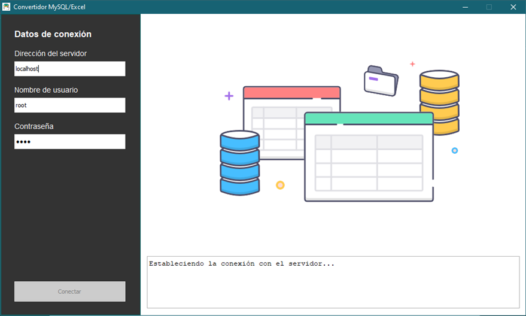
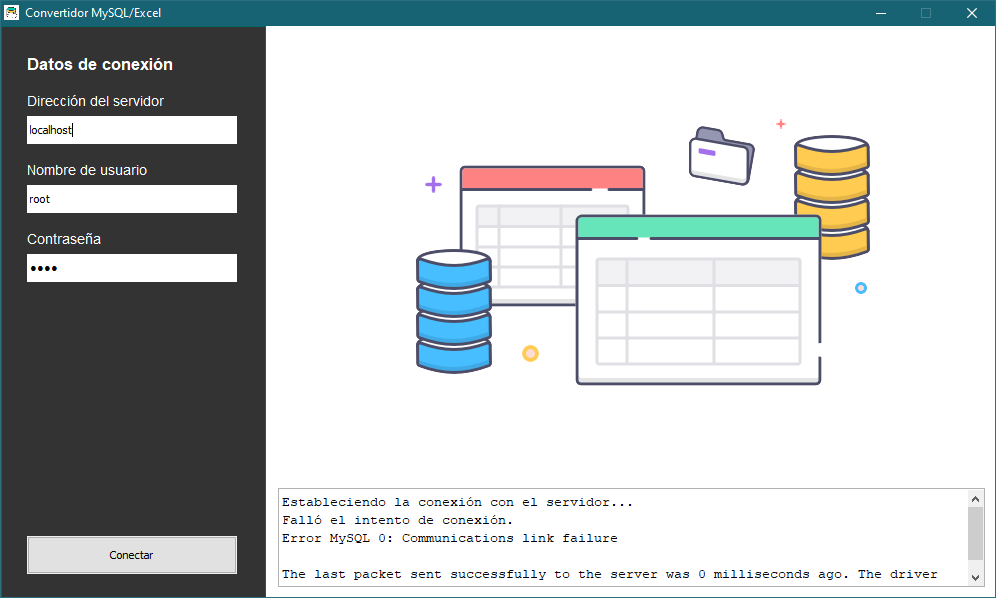
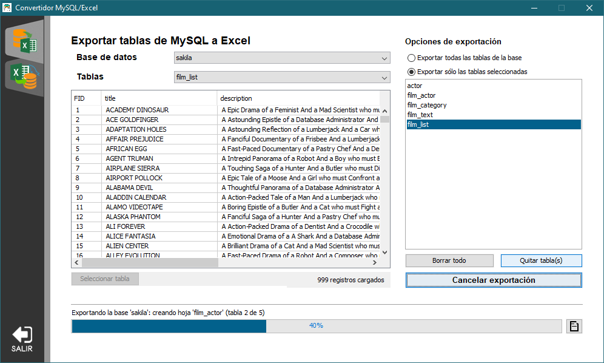

# Convertidor MySQL-Excel
Programa que permite extraer los datos de una base MySQL para crear un archivo Excel con ellos.
Tambien es posible crear una base de datos nueva con el contenido de un libro de trabajo de Excel.

## Características
### Exportación de bases de datos
* Acceso al sistema con las credenciales de usuario
* Se incluye un panel donde es posible visualizar las tablas de la base seleccionada
* Las celdas del archivo creado pertenecen al tipo de dato obtenido desde la base
* Es posible ver el progreso de la exportación y los detalles ocurridos en el proceso
* El proceso de exportación se puede cancelar en cualquier momento

### Importación de bases de datos
* Se incluye un panel para visualizar las hojas del archivo abierto
* Creación de un archivo Excel en el que cada hoja corresponde con una tabla de la base de datos
* El usuario puede seleccionar cuales tablas se van a incluir en el archivo
* Creación de una base de datos nueva utilizando los datos del archivo Excel abierto en el programa
* El usuario puede seleccionar las hojas del archivo que serán convertidas en tablas
* Antes de crear la base, el usuario puede configurar el tipo de dato y los modificadores de cada columna en la hoja, los cuales son utilizados para definir la estructura de la tabla nueva.
* Es posible ver el progreso y sus detalles durante el proceso de importación
* El proceso de importación se puede cancelar en cualquier momento

## Capturas de pantalla del programa en funcionamiento
* Explicando brevemente, el funcionamiento del programa es el siguiente:

* Al iniciar el programa la pantalla que aparece es la que le permite al usuario realizar una conexión con el servidor de bases de datos. Cuando el usuario escribe sus credenciales, el programa muestra un mensaje indicando que se está intentando conectar con el servidor MySQL especificado. Si no se puede establecer la conexión, el programa muestra un mensaje describiendo el motivo.

* Cuando se puede crear una nueva conexión con el servidor, el programa cambia la pantalla y muestra un menú lateral en donde se puede seleccionar la sección de importación o exportación. Por defecto, al establecer la conexión, el programa muestra la sección de exportación.

* En esta sección se puede seleccionar alguna de las bases de datos del servidor y se puede seleccionar una tabla en específico para poder ver sus datos en pantalla. El usuario puede exportar todas las tablas en la base de datos seleccionada o puede escoger solo las tablas que desea exportar mediante el botón 'Seleccionar tabla'. Tambien puede editar la lista de tablas seleccionadas.

* Cuando se presiona el botón 'Exportar', y después de haber seleccionado la ubicación del archivo, se habilita una ventana en donde se describen los eventos ocurridos al ir creando el archivo de Excel, y el progreso en la exportación de cada tabla se muestra en la barra inferior.

## Lenguajes y herramientas
* El proyecto está escrito completamente en el lenguaje Java
* Para establecer la conexión con el servidor de bases de datos se utilizó la librería mysql-connector-java-5.1.18
* Para crear los archivos Excel se utilizó la librería Apache POI 4.1.1

## Créditos
* Ícono del programa: [Ícono de base de datos](https://es.pngtree.com/freepng/database-icon-design--interaction-icon-vector-design_4158835.html) por [apriliya](https://es.pngtree.com/apriliya_10564130?type=1)
* Ícono de checkbox: [Checked checkbox icon](https://toppng.com/checked-checkbox-icon-checkbox-ico-PNG-free-PNG-Images_229651) por [John3](https://toppng.com/john3)
* Ícono de reporte: [Free icon report](https://flyclipart.com/es/free-icon-reports-report-icon-free-text-clothing-apparel-hd-png-download-1254786)
* Ícono de cierre de sesión: [Icono de inicio de Sesión - cierre de sesión](https://www.freepng.es/png-iaybnc/)