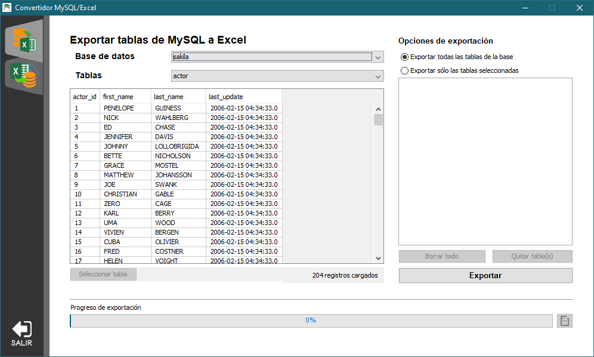
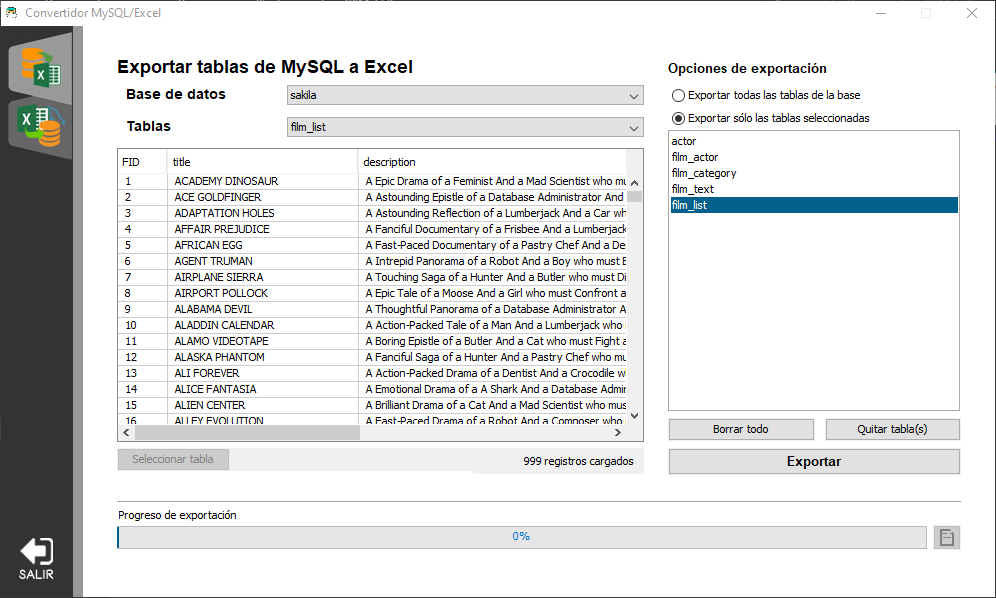
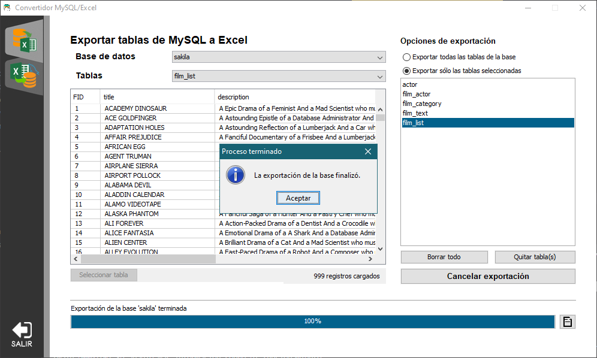
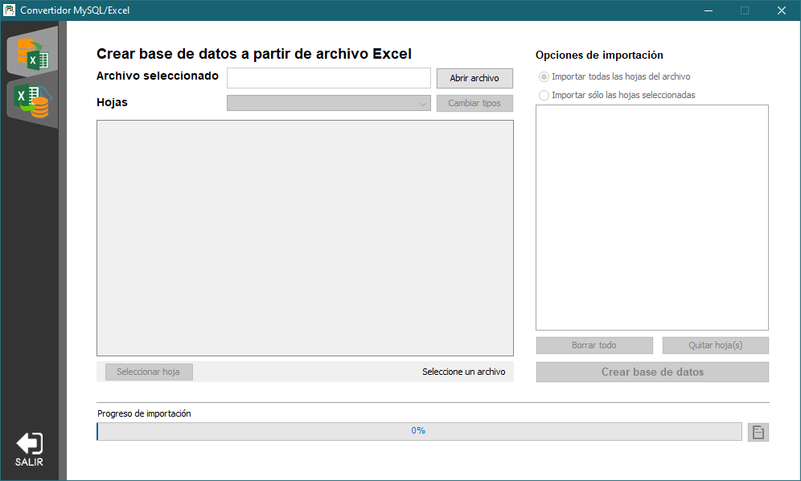
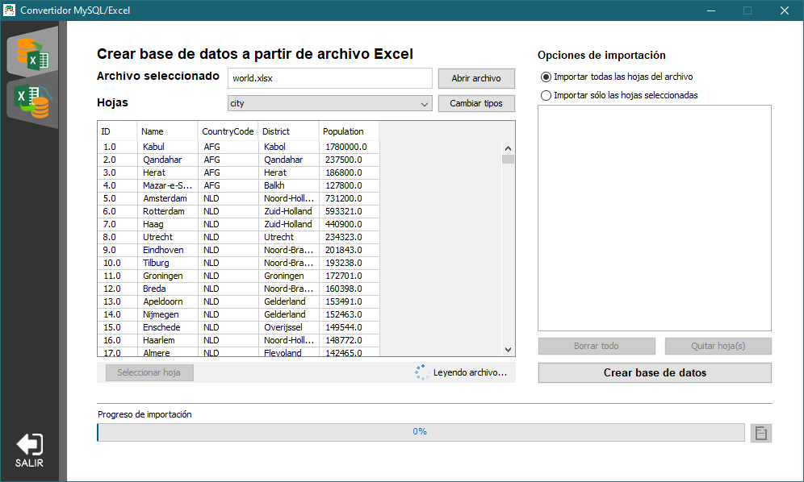
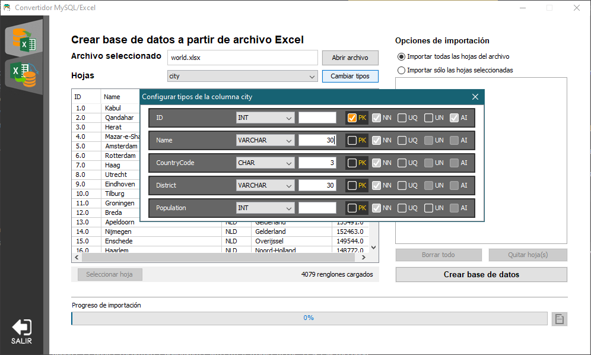
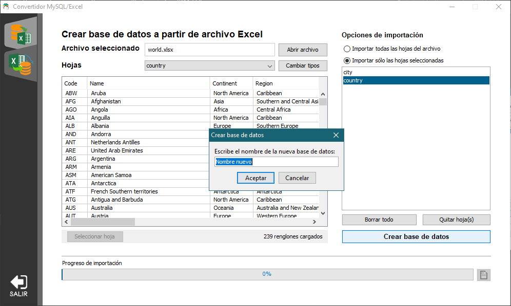
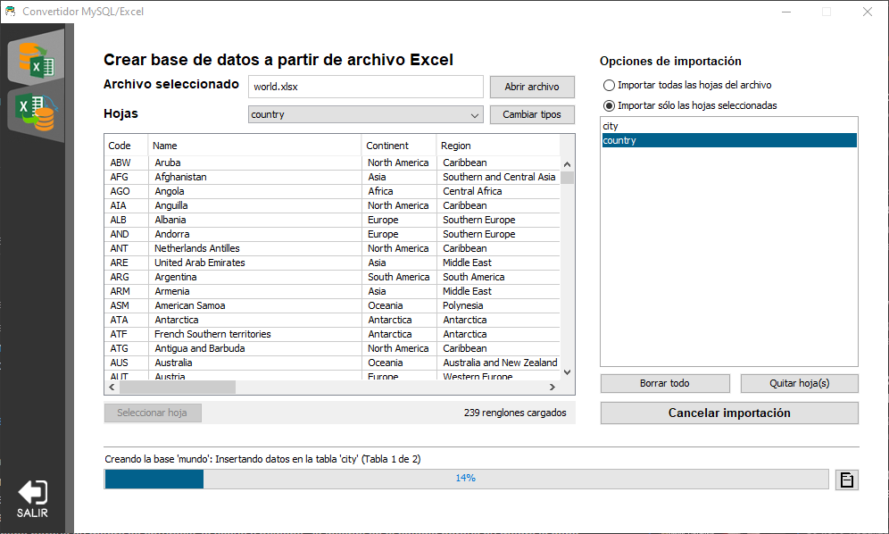
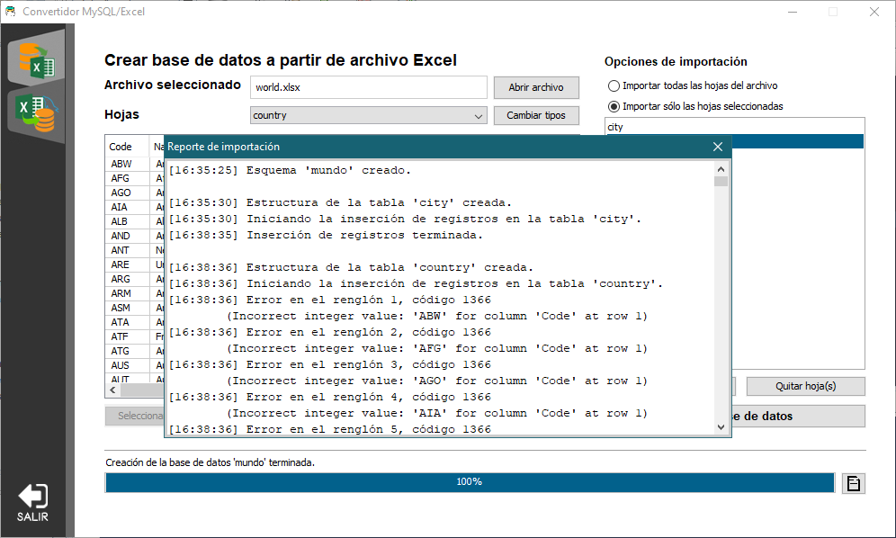
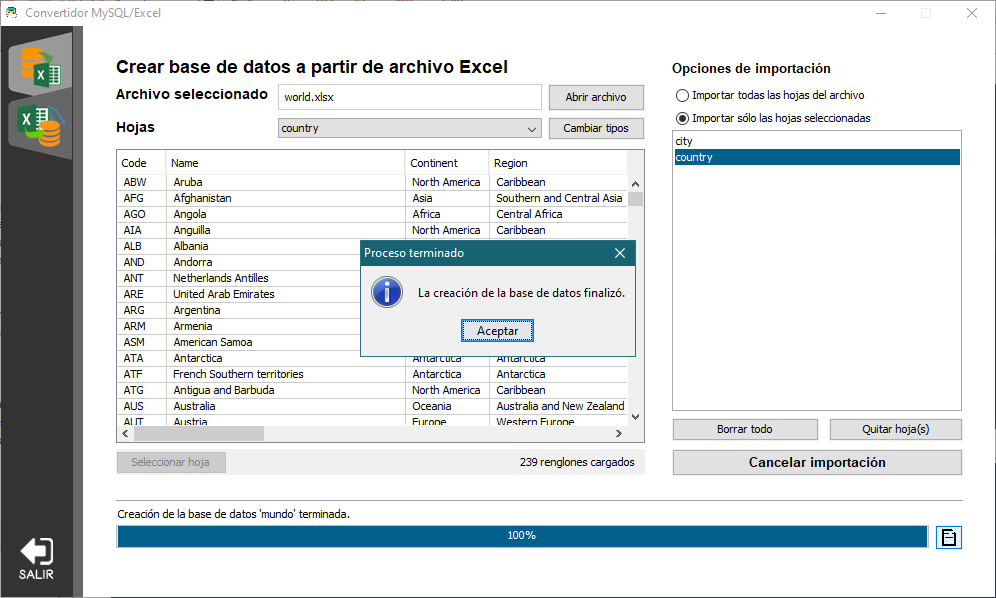

# Convertidor MySQL-Excel
Programa que permite extraer los datos de una base MySQL para crear un archivo Excel con ellos.
Tambien es posible crear una base de datos nueva con el contenido de un libro de trabajo de Excel.

## Características
* Acceso al sistema con las credenciales de usuario
* El usuario puede visualizar los datos de una tabla o de una hoja determinada
* El usuario puede seleccionar sólo los elementos (tablas u hojas) que desea exportar o importar
* Los procesos de exportación/importación se pueden cancelar en cualquier momento
* Si el usuario intentar terminar la conexión o cerrar el programa mientras se está realizando un proceso, el programa le solicita confirmar la acción
* Es posible ver el progreso y los detalles ocurridos en los procesos

### Exportación de bases de datos
* La exportación consiste en la creación de un archivo de Excel con los datos obtenidos de una base en el servidor MySQL
* En el archivo de Excel creado, las columnas de una hoja toman el tipo de dato especificado por su correspondiente tabla en la base de datos
* Cada hoja del archivo nuevo tiene un estilo básico predefinido.

### Importación de bases de datos
* La importación consiste en la creación de una base de datos nueva utilizando los datos contenidos en un archivo de Excel
* Antes de crear la base, el usuario puede configurar el tipo de dato y los modificadores de cada columna en la hoja, los cuales son utilizados para definir la estructura de la tabla nueva.

## Capturas de pantalla del programa en funcionamiento
* Explicando brevemente, el funcionamiento del programa es el siguiente:

* Al iniciar el programa la pantalla que aparece es la que le permite al usuario realizar una conexión con el servidor de bases de datos. Cuando el usuario escribe sus credenciales, el programa muestra un mensaje indicando que se está intentando conectar con el servidor MySQL especificado. Si no se puede establecer la conexión, el programa muestra un mensaje describiendo el motivo.

* Cuando se puede crear una nueva conexión con el servidor, el programa cambia la pantalla y muestra un menú lateral en donde se puede seleccionar la sección de importación o exportación. Por defecto, al establecer la conexión, el programa muestra la sección de exportación.

* En esta sección se puede seleccionar alguna de las bases de datos del servidor y se puede seleccionar una tabla en específico para poder ver sus datos en pantalla. El usuario puede exportar todas las tablas en la base de datos seleccionada o puede escoger solo las tablas que desea exportar mediante el botón 'Seleccionar tabla'. Tambien puede editar la lista de tablas seleccionadas.

* Cuando se presiona el botón 'Exportar', y después de haber seleccionado la ubicación del archivo, se habilita una ventana en donde se describen los eventos ocurridos al ir creando el archivo de Excel, y el progreso en la exportación de cada tabla se muestra en la barra inferior.

* Al terminar de escribir los datos en todas las hojas, se muestra un mensaje que indica que el proceso ha terminado de forma correcta.

* Cada hoja del archivo nuevo tiene un estilo como el de la siguiente imágen:

* Si el usuario selecciona en el menú lateral la opción que corresponde a la sección de importación, se muestra la siguiente pantalla:

* Despues de seleccionar un archivo para abrirlo, el usuario puede ver los datos de cada hoja seleccionando el nombre de la misma en la lista superior.

* De igual forma que en la sección de exportación, el usuario puede seleccionar en una lista únicamente las tablas que desea que se incluyan en la base de datos nueva. 
* Cuando una hoja está seleccionada en el combo box y se hace clic en el botón 'Cambiar tipos' aparece una nueva ventana en donde se muestra un conjunto de paneles en el que cada uno corresponde con una columna de la hoja seleccionada. Cada panel muestra el nombre de la columna e incluye los campos para cambiar el tipo de dato de la columna, agregar parámetros a ese tipo de dato y asignar los modificadores de llave primaria, campo no nulo, de valor único, valor sin signo y de auto incremento. 

* Cuando el usuario presiona el botón 'Crear base de datos', debe introducir un nombre válido para la base de datos nueva.

* Cuando comienza el proceso, el progreso de la importación se muestra en la barra inferior, al igual que en la sección de exportación: 

* Los eventos ocurridos (por ejemplo, la creación de una tabla nueva o una excepción ocurrida) se pueden consultar haciendo clic en el botón ubicado junto a la barra de progreso.

* La importación se puede cancelar en cualquier momento haciendo clic en el botón 'Cancelar'. Al terminar la inserción de datos en la base, aparece una ventana de notificación:

* Al consultar la creación del esquema, por ejemplo, en MySQL Workbench, se obtienen los siguientes resultados en onde se muestran la información de las columnas de todas las tablas:

## Lenguajes y herramientas
* El proyecto está escrito completamente en el lenguaje Java
* Para establecer la conexión con el servidor de bases de datos se utilizó la librería mysql-connector-java-5.1.18
* Para crear los archivos Excel se utilizó la librería Apache POI 4.1.1

## Créditos
* Ícono del programa: [Ícono de base de datos](https://es.pngtree.com/freepng/database-icon-design--interaction-icon-vector-design_4158835.html) por [apriliya](https://es.pngtree.com/apriliya_10564130?type=1)
* Ícono de checkbox: [Checked checkbox icon](https://toppng.com/checked-checkbox-icon-checkbox-ico-PNG-free-PNG-Images_229651) por [John3](https://toppng.com/john3)
* Ícono de reporte: [Free icon report](https://flyclipart.com/es/free-icon-reports-report-icon-free-text-clothing-apparel-hd-png-download-1254786)
* Ícono de cierre de sesión: [Icono de inicio de Sesión - cierre de sesión](https://www.freepng.es/png-iaybnc/)